# Comprehensive Report: EV Market Analysis Based on Visualizations

## Introduction
The electric vehicle (EV) market is growing rapidly due to consumer demand for sustainable transportation and government incentives. 

To guide decision-making, this analysis employs data visualization techniques to derive insights across various sub-domains. 

The data transformations applied to **`ev_main__df`**, **`ev_efficiency__df`**, and **`ev_manufacturing__df`** enabled meaningful visualizations to address key questions in market analysis, consumer behavior, product optimization, and strategic planning.

## Methodology

The dataset was preprocessed through cleaning, imputations, and transformations. The following visualizations were generated:

1. **Scatter Plot** to examine relationships between range and price.
2. **Bar Plots** for brand-wise efficiency, price segmentation, and efficiency classifications.
3. **Box Plot** for price distribution by brand.
4. **Pie Chart** for visualizing market share based on sales.
5. **Bar Plot** for comparative studies of manufacturing locations.
6. **Time-series trends** using hypothetical launch dates.

## Challenges and Solutions

### Challenge 1: Mutating the Brand with Correct Values `[ev_main.csv / ev_main__df]`

In the above code's output, that a particular model ( _**i3**_ for example ) has multiple **16 Brands** associated with it. Meaning in our original dataset, there are multiple records for a single model. 

This case has been observed for other records as well, but with different variations in terms of number of brands associated with a single model.

As per our dataset, the _**i3** Model_ is manufactured by **16 different brands** that are 
, Volkswagen
, BMW
, Lucid
, Volvo
, Mercedes-Benz
, Audi
, Hyundai
, Chevrolet
, Rivian
, Tesla
, Nissan
, Ford
, Jaguar
, nan
, Polestar
, Kia

This is a huge discrepancy in our dataset and can affect our further analysis becasue:
- a brand can have multiple models and therefore, a model is manufactured by a single brand.
- a model **cannot** be manufactured by multiple brands. 

### Solution

To solve the above specified issue, we've defined a dictionary that where the Model: Brand as the key:value pair.

Then we use the **`df.map()`** method to select the "Model" column to set the value of "Brand" that correponds to that specific "Model" key.

### Challenge 2: Making the car specification consistent. `[ev_main.csv / ev_main__df]`

In the dataset, the specification of the car even for the same "Model", witness a lot of data inconsistency.

The fields like `Launch_Date`, `Date` (Sales_Date), `Sales` and `Price` (affected by inflation), can vary, but fields like `Range`, `Battery_Capacity`, `Charging_Speed`, `Acceleration`, `Top_Speed` and `Seating_Capacity` should stay consistent for each unique model throughout the dataset.

> The only case where the variation can be acceptable, is when the change is consistent after the records have been group by Launch_Date. 
   This goes to show that the `Brand` has made improvements in certain `Models` in specific year when the `Model` has launched. 
   It means the decision and planning of making the modifcations in a `Model` has already taken place `x` no. of years before the launch  year.

### Solution

All the records were groupred by their `Models` and the np.nan values (missing values) of `Range`, `Battery_Capacity`, `Charging_Speed`, `Acceleration`, `Top_Speed` and `Seating_Capacity` fields had been imputed by their respective **mode** values.

### Challenge 3: Formatting and Replacing Values `[ev_efficiency.csv / ev_efficiency__df]` and `[ev_manufacturing.csv / ev_manufacturing__df]`

1. In the **`ev_efficiency__df`** dataframe, the values of **`Efficiency`**, **`Drag_Coefficient`**, **`Tire_Rolling_Resistance`** have been rounded up to 2 digits after the decimal point for better interpretation.

2. In the in **`ev_manufacturing__df`** dataframe, Fill np.nan values in **`Secondary_Manufacturing_Location`** with their corresponding **`Primary_Manufacturing_Location`**.

## Visualizations

### Electric Vehicle Range vs Price
**Figure 6.2.1**

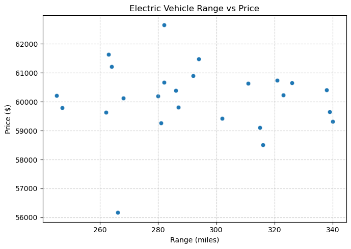

### Average Efficincy by Brand
**Figure 6.2.2**

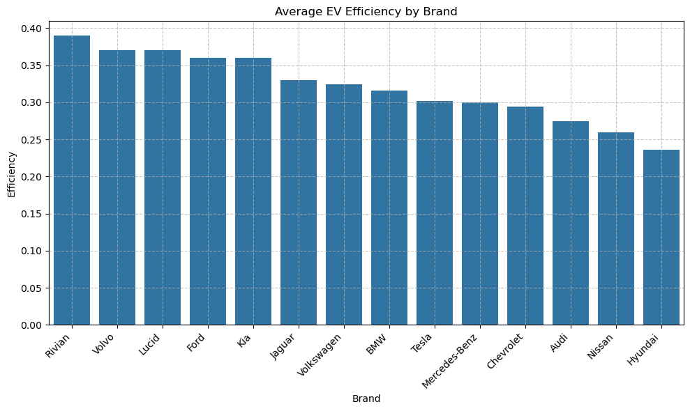

### Price Distribution by Brand
**Figure 6.2.3**

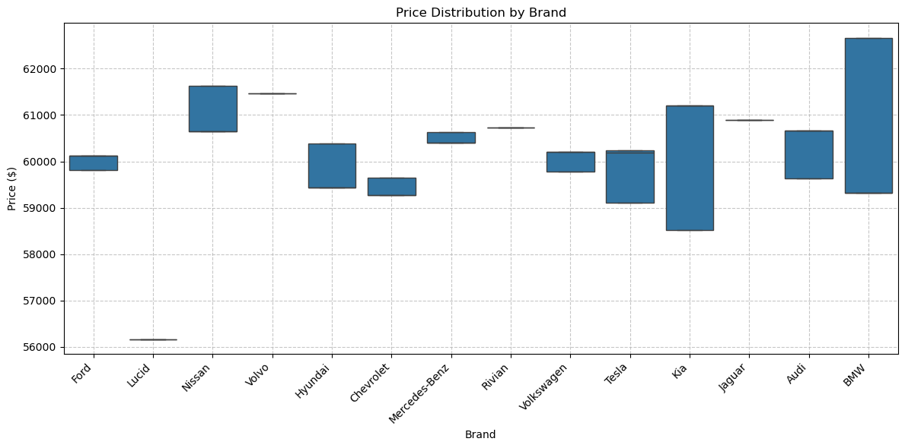

### EV Market Share by Brand
**Figure 6.2.4**

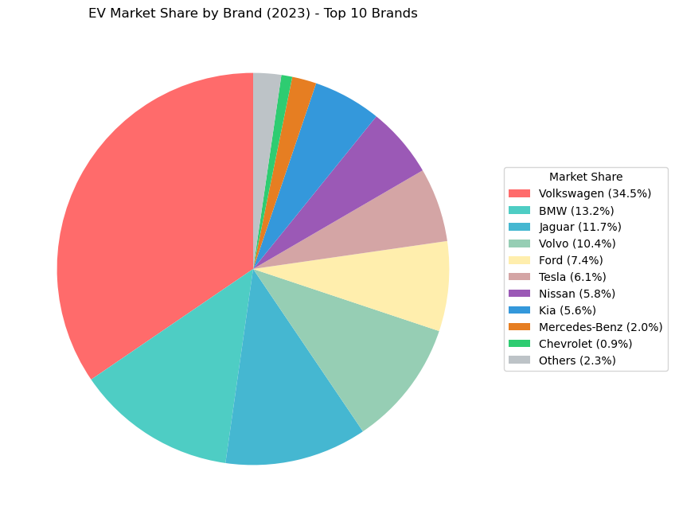

### Range, Price and Efficiency by Brand and Manufacturing Location
**Figure 7.1.1**

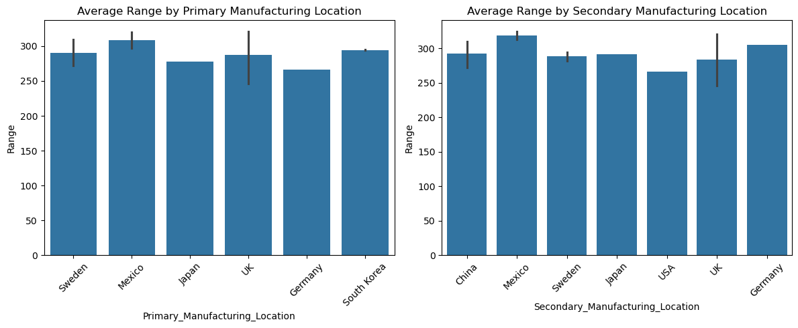

**Figure 7.1.2**

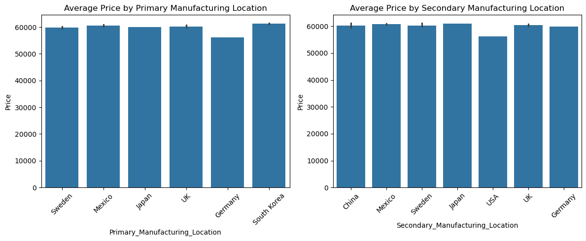

**Figure 7.1.3**

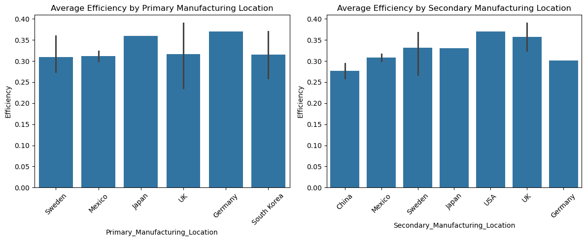

### Distribution of Price Categories Across Brands

**Figure 7.2.1**

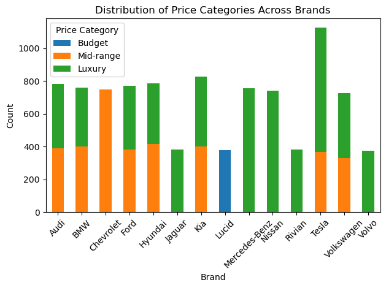

**Figure 7.2.2**

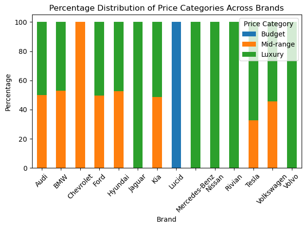

### Top EV Brands By Value Score

**Figure 7.3.1**

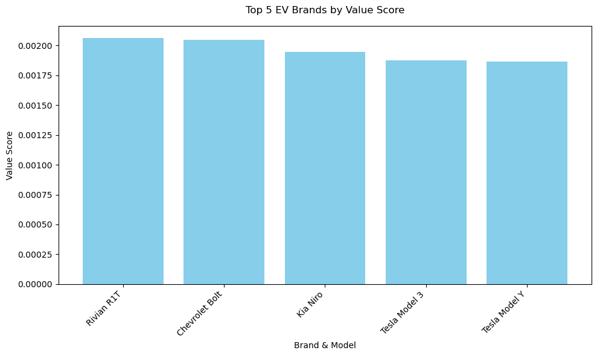

### Distribution of Efficiency Scores by Brands

**Figure 7.4.1**

### Average Efficiency Score, Value Score and Sales by Brand

**Figure 7.5.1**

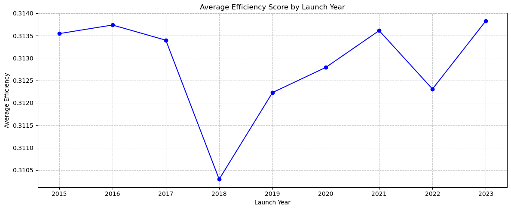

**Figure 7.5.2**

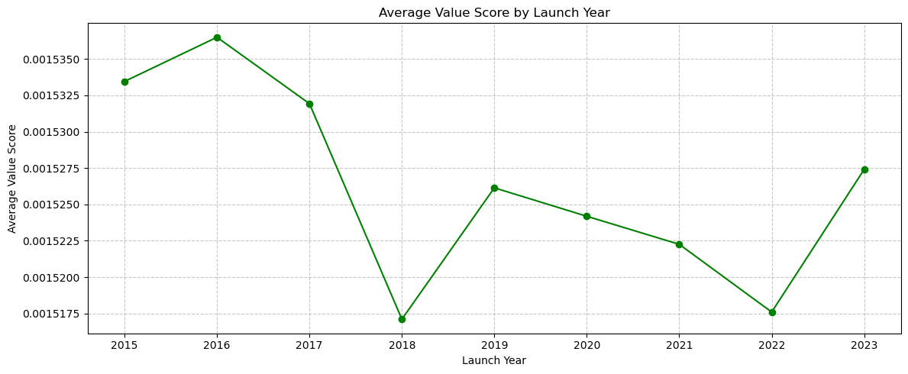

**Figure 7.5.3**

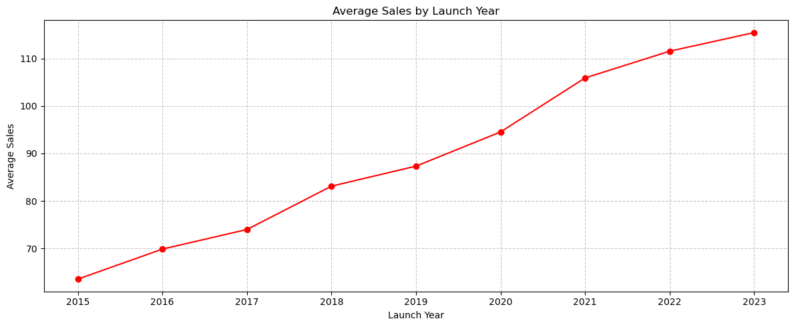

## Key Findings and Insights

### 1. Market and Competitor Analysis ([Figure 6.2.4])
The market share analysis revealed dominance by a few key brands, with others capturing smaller shares. This indicates potential areas for new entrants or lesser-known brands to capture underserved segments.

- **Insight:** Larger brands dominate due to economies of scale, superior marketing, and extensive dealer networks.
- **Action:** Small brands should focus on niche markets or differentiated offerings like ultra-luxury or high-efficiency vehicles.

### 2. Consumer Behavior and Segmentation ([Figure 7.2.X])
Bar plots categorized vehicles into budget, mid-range, and luxury segments. Brands showed significant variability in price distribution, with some targeting primarily one segment and others spanning all categories.

- **Insight:** Consumer preferences are diverse; brands with offerings across all price ranges capture broader market appeal.
- **Action:** Brands should diversify their portfolio to meet the demands of different income groups.

### 3. Product Performance and Value Optimization ([Figure 6.2.1], [7.3])
The scatter plot between range and price revealed a clear positive correlation, suggesting that higher-range vehicles command premium prices. Top 5 models based on the Value_Score balanced price, range, and efficiency effectively.

- **Insight:** Mid-range EVs offer the best value proposition, attracting budget-conscious yet performance-driven buyers.
- **Action:** Optimize price-performance ratios for mid-range vehicles while maintaining competitive pricing for higher-end models.

### 4. Operational and Manufacturing Insights ([Figure 7.1.X])
Manufacturing location comparisons highlighted cost and efficiency differences across plants. Brands manufacturing in specific regions consistently delivered better performance metrics.

- **Insight:** Regional manufacturing advantages stem from proximity to resources and skilled labor.
- **Action:** Consider expanding manufacturing capabilities in high-performing regions to optimize production costs and vehicle quality.

### 5. Sustainability and Energy Efficiency ([Figure 6.2.2], [Figure 7.4])
Efficiency ratings varied significantly by brand. A high percentage of vehicles were categorized as low efficiency, signaling room for improvement.

- **Insight:** Brands with consistent high-efficiency models gain a competitive edge in eco-conscious markets.
- **Action:** Invest in R&D to improve drivetrain and battery efficiencies while maintaining competitive pricing.

### 6. Strategic Growth and Planning ([Figure 7.5.X])
Time-based trends (using hypothetical launch dates) revealed increasing adoption of EVs over recent years. Peaks corresponded with government incentives or new technology releases.

- **Insight:** Market demand aligns with policy changes and technological innovation cycles.
- **Action:** Strategically align product launches with new government policies and major technology rollouts to capture market momentum.

## Suggested Analyses and Questions

### 1. Product Performance and Value Optimization
#### Suggested Analyses:
- Compare the impact of pricing strategies on vehicle range and efficiency to determine optimal pricing bands.
- Identify features most strongly correlated with higher consumer ratings or sales figures.
- Perform a comparative analysis of battery technology across models to understand its contribution to range and efficiency.
- Analyze repair and maintenance data to assess long-term value provided by different brands.
- Create cluster analyses of EV models based on performance metrics (efficiency, range, and value score).

#### Questions:
1. What price ranges are associated with the best trade-off between range and efficiency for consumers?  
2. Which vehicle features (e.g., autonomous driving, premium interiors) most enhance perceived value?  
3. How do battery technologies differ across models, and which offers the best efficiency per cost?  
4. What factors lead to low long-term maintenance costs in EVs, and which brands excel in this area?  
5. How do performance metrics vary by geographical region or customer preferences?

### 2. Sustainability and Energy Efficiency
#### Suggested Analyses:
- Measure the lifecycle carbon footprint of vehicles, including production and disposal phases.
- Analyze energy efficiency trends by manufacturing location and model year to identify advancements.
- Study the relationship between vehicle efficiency and sales performance in markets with strict emission regulations.
- Evaluate the alignment of charging infrastructure deployment with high-efficiency vehicle adoption.
- Investigate how recyclable materials in manufacturing impact consumer perception and sales.

#### Questions:
1. How do regional differences in production methods affect the sustainability profiles of EVs?  
2. Which models or brands have the smallest environmental impact throughout their lifecycle?  
3. Are energy-efficient EVs performing better in regions with stricter emission regulations?  
4. How does the use of renewable energy in manufacturing correlate with customer perception?  
5. What role does charging infrastructure availability play in the adoption of energy-efficient vehicles?

### 3. Strategic Growth and Planning
#### Suggested Analyses:
- Identify regions with the highest potential for EV adoption based on current sales and market trends.
- Analyze the effectiveness of government incentives in driving sales across different markets.
- Evaluate competitive positioning using market share trends and competitor feature sets.
- Study historical launch trends to forecast optimal timings for new product releases.
- Map customer feedback and reviews to strategic priorities for product improvement.

#### Questions:

1. What untapped markets or regions present the best opportunities for EV expansion?  
2. How do government incentives and policies influence sales trends in key regions?  
3. Which competitor strategies have been most effective in gaining market share?  
4. What product features should be prioritized to align with future market demands?  
5. How can trends in launch timelines inform strategic decisions for future EV rollouts?

## Conclusion
This analysis highlights the multidimensional aspects of the EV market, addressing critical business questions across market share, consumer preferences, product optimization, and operational efficiencies. 

Brands must focus on diversifying product lines, enhancing efficiency, and leveraging manufacturing advantages to stay competitive. 

Strategic alignment with market trends and sustainability goals will drive long-term success in this dynamic industry.